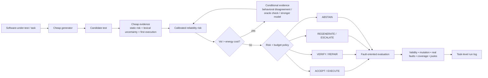

# GreenUTest

**Uncertainty-guided, energy-adaptive LLM software testing.**

GreenUTest is a reproducible research harness for studying a simple question:

> **When is extra AI computation actually worth spending on a generated software test?**

Instead of applying the same generation, verification, repair, and escalation budget to every testing task, GreenUTest acquires uncertainty evidence in stages, calibrates the risk that a generated test is unreliable or low-value, and routes each task through the least expensive action that is justified by expected testing value.

This repository contains **experiment code only**. The manuscript is intentionally not stored here.

## Research scope

GreenUTest separates test quality into distinct observable outcomes rather than treating a passing test as automatically correct:

- syntax validity;
- execution validity;
- oracle validity;
- fault triggering;
- fault detection / mutant killing;
- false validation;
- incremental test value.

The core policy can choose among:

`ACCEPT -> EXECUTE -> VERIFY -> REPAIR -> REGENERATE -> ESCALATE -> ABSTAIN`

An optional **value-of-information (VoI) gate** decides whether buying another uncertainty signal is worth its expected energy cost before that signal is acquired.

## Repository status

**Stage: pre-experiment infrastructure.** No paper results are committed. No result in this repository should be interpreted as a scientific finding until it is generated from the frozen held-out protocol.

The code ships with a CPU-only deterministic toy benchmark and fake models so the full orchestration path can be tested before downloading models or benchmarks.

## Framework



A publication-style vector framework diagram is available at [`assets/greenutest_framework.svg`](assets/greenutest_framework.svg), with design notes in [`docs/PROTOCOL.md`](docs/PROTOCOL.md).

## Experiment design

The intended confirmatory pipeline uses four partitions:

1. **pilot** — instrumentation/debugging only;
2. **calibration-fit** — uncertainty calibration/fusion;
3. **policy-tuning** — routing, VoI thresholds, energy budgets;
4. **held-out final** — untouched until the analysis plan is frozen.

GreenUTest never tunes thresholds or non-inferiority margins on held-out outcomes.

### Planned benchmark roles

| Benchmark | Role | Redistribution policy |
|---|---|---|
| ULT / UnLeakedTestBench | Primary contamination-conscious function-level test generation | Fetch from upstream; do not mirror hidden/ground-truth tests |
| BugsInPy | Real buggy/fixed pairs and false-validation analysis | Clone pinned upstream; do not vendor projects |
| TestExplora | Proactive repository-level Fail-to-Pass validation | Pinned harness + external benchmark JSON; hash locally |
| SWE-Mutation | Discriminative test-suite stress test | Fetch/clone upstream; respect upstream license |
| TestGenEvalLite | Repository/file-level robustness extension | External optional benchmark; upstream licensing applies |
| Toy benchmark | CI/smoke testing only | Included here |

See [`docs/PROTOCOL.md`](docs/PROTOCOL.md), [`data/DATASETS.md`](data/DATASETS.md), and [`data/upstreams.json`](data/upstreams.json).

## Baselines

The harness includes policy implementations/configuration for:

- small/local model only;
- strong model only;
- fixed self-consistency;
- random routing at a matched escalation rate;
- raw-confidence routing;
- static complexity/risk routing;
- STARouter-style state routing adapter;
- SWE-Router-style temporal/exploration routing control;
- fixed-depth execution/coverage-feedback refinement adapter;
- specification-first / independent-oracle verification;
- traditional non-LLM test generation adapter;
- GreenUTest full policy and ablations.

“Style” adapters are **clean-room experimental interfaces**, not copied implementations of the original systems. If an upstream implementation is later integrated, it must be pinned and documented separately.

See [`docs/PROTOCOL.md`](docs/PROTOCOL.md) and [`data/BASELINES.md`](data/BASELINES.md).

## Quick start — zero GPU burn

### Windows PowerShell

```powershell
py -3.11 -m venv .venv
.\.venv\Scripts\Activate.ps1
python -m pip install --upgrade pip
pip install -e ".[dev]"
python -m greenutest doctor
python -m greenutest dry-run --output artifacts/dry-run
python -m unittest discover -s tests -v
```

Or:

```powershell
powershell -ExecutionPolicy Bypass -File scripts/bootstrap.ps1
```

### Linux / WSL

```bash
python3.11 -m venv .venv
source .venv/bin/activate
python -m pip install --upgrade pip
pip install -e '.[dev]'
python -m greenutest doctor
python -m greenutest dry-run --output artifacts/dry-run
python -m unittest discover -s tests -v
```

## GPU/local-model setup

Do **not** install the heavy model stack until the dry-run passes.

```powershell
pip install -e ".[dev,analysis,energy,local-hf]"
python -m greenutest doctor --require-nvml
```

Recommended first local-model experiment profile:

- **cheap tier:** `Qwen/Qwen2.5-Coder-1.5B-Instruct`;
- **strong local tier:** `Qwen/Qwen2.5-Coder-7B-Instruct` (same family, cleaner capability/energy comparison);
- **cross-family robustness tier:** `mistralai/Mistral-7B-Instruct-v0.3`;
- exact model/tokenizer revisions and quantization are frozen after the excluded hardware pilot.

Model IDs are configuration defaults, **not scientific commitments** until `configs/frozen/` is generated.

The local Transformers backend records generated-token mean NLL, an uncalibrated geometric-mean token-probability confidence signal, prompt/token counts, prompt hash, and resolved model/tokenizer revisions. Confirmatory model construction rejects unresolved revisions. See [`docs/MODEL_TELEMETRY.md`](docs/MODEL_TELEMETRY.md).

## Fetch benchmark sources

Dry-run first. Then inspect the manifest and fetch only the benchmark you need:

```powershell
python scripts/fetch_benchmarks.py --list
python scripts/fetch_benchmarks.py --name ult --dest external
python scripts/fetch_benchmarks.py --name bugsinpy --dest external
python scripts/fetch_benchmarks.py --name testexplora --dest external
```

The fetcher checks out exact pinned revisions by default. Large datasets, cloned projects, model weights, benchmark caches, generated tests, and run outputs are ignored by Git.

## Run architecture

```text
TaskAdapter
   -> ModelBackend
   -> CandidateTest
   -> Evidence acquisition
   -> Risk calibration
   -> VoI gate
   -> Routing policy
   -> Test execution / verification / repair / escalation
   -> Fault-oriented evaluation
   -> Energy accounting
   -> immutable task-level JSONL record
```

Every task-level record includes experiment identifiers, benchmark/task identity, model/prompt/seed metadata, action trace, uncertainty evidence, test outcomes, and energy telemetry. The machine-readable contract is [`data/runlog.schema.json`](data/runlog.schema.json).

## Commands

```bash
python -m greenutest doctor
python -m greenutest dry-run --output artifacts/dry-run
python -m greenutest inspect-manifest
python -m greenutest inspect-model-plan --config configs/experiment.json
# After telemetry checks only; this loads one model and may use the GPU:
python -m greenutest model-smoke --config configs/experiment.json --model qwen25coder15b
python scripts/freeze_analysis_plan.py --input configs/experiment.json --output configs/confirmatory.lock.json
python scripts/verify_runlog.py artifacts/dry-run/runlog.jsonl
python scripts/snapshot_environment.py --output artifacts/environment.json
```

## Energy protocol

Primary quantity: **direct Joules / Wh**, sampled from NVIDIA NVML where available and integrated from timestamped power samples using the trapezoidal rule.

We distinguish:

- model load/warm-up;
- prefill;
- decoding;
- uncertainty acquisition;
- test execution;
- verification;
- repair/regeneration;
- mutation/coverage evaluation.

Raw GPU energy is the primary directly observed GPU measure. Idle-adjusted energy is a sensitivity analysis. API-provider energy is not guessed when provider telemetry is unavailable.

See [`docs/PROTOCOL.md`](docs/PROTOCOL.md).

## Scientific guardrails

- No held-out final result may be used to set a threshold, model tier, energy budget, or non-inferiority margin.
- Pilot rows are excluded from confirmatory tables.
- A “passing” generated test is not automatically labeled oracle-valid.
- Dataset/setup failures are tracked separately from model failures.
- Every paper-facing number must be generated from archived task-level logs by a versioned analysis script.
- Raw benchmark data, model weights, API keys, paper source, and unreleased results are not committed.

## Directory map

```text
assets/                 publication-style framework SVG
configs/                experiment, model, policy, prompt and retry controls
data/                   upstream manifest + run-log schema (no mirrored corpora)
docs/                   consolidated protocol and scientific guardrails
scripts/                bootstrap, fetch, freeze, split, snapshot and validation helpers
src/greenutest/         research harness (adapters, signals, routing, energy, runner)
tests/                   deterministic no-GPU tests
```

## Reproducibility

Before a full run, archive:

- Git commit SHA;
- Python, OS, CUDA, driver, PyTorch, Transformers versions;
- GPU name + dedicated VRAM;
- model revision + tokenizer revision + quantization;
- benchmark revision/checksum;
- prompt version;
- task split hash;
- random seeds;
- energy sampling interval;
- policy configuration hash;
- frozen confirmatory-analysis-plan hash.

See [`docs/PROTOCOL.md`](docs/PROTOCOL.md).

## Security

Generated tests and benchmark repositories are **untrusted code**. The default dry-run is safe because it does not execute external code. Real benchmarks should be executed in isolated environments/containers with network access disabled where feasible, resource/time limits, and explicit workspace boundaries. Read [`SECURITY.md`](SECURITY.md) before enabling benchmark execution.

## Citation

A `CITATION.cff` file is included for the software artifact. Paper citation metadata should be added only after publication/acceptance.

## License

GreenUTest's original code is released under the Apache License 2.0. Third-party benchmarks, models, datasets, and baseline implementations remain under their respective licenses; see [`THIRD_PARTY.md`](THIRD_PARTY.md).
