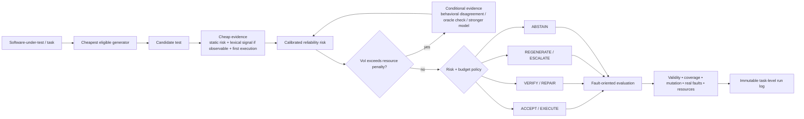

# GreenUTest

**Uncertainty-guided, energy-adaptive LLM software testing.**

GreenUTest is a reproducible research harness for one central question:

> **When is extra AI computation actually worth spending on a generated software test?**

Rather than applying the same generation, verification, repair and escalation budget to every task, GreenUTest acquires uncertainty evidence cheap-first, calibrates reliability risk, and buys additional computation only when its expected testing value justifies the resource cost.

This repository contains **experiment code only**. The manuscript is intentionally not stored here.

## Scientific scope

GreenUTest does not treat “the generated test passed” as equivalent to “the generated test is correct.” It separates:

- syntax validity;
- execution validity;
- oracle validity;
- fault triggering;
- real-fault detection / Fail-to-Pass behavior;
- realistic mutant killing / discriminative power;
- false validation;
- coverage and mutation quality;
- incremental testing value;
- directly observed local energy and hosted-provider resource usage.

The policy action space is:

`ACCEPT -> EXECUTE -> VERIFY -> REPAIR -> REGENERATE -> ESCALATE -> ABSTAIN`

An optional **value-of-information (VoI)** gate decides whether another uncertainty signal is worth acquiring before paying its compute/energy cost.

## Repository status

**Stage: pre-experiment infrastructure / preflight.** No paper result is committed here. Pilot rows are explicitly non-scientific and excluded from confirmatory tables.

The package includes a deterministic CPU-only toy benchmark, fake models, invariant tests, local Hugging Face backends, lazy hosted-provider backends, dataset manifests, and a generation-only ULT/PLT preflight bridge.

## Framework



A standalone academic vector diagram is available at [`assets/greenutest_framework.svg`](assets/greenutest_framework.svg).

## Locked model plan

GreenUTest now uses **seven core models** across three scientific strata.

| Study role | Model key | Model |
|---|---|---|
| Cheap controlled tier | `qwen25coder15b` | Qwen2.5-Coder-1.5B-Instruct |
| Stronger same-family tier | `qwen25coder7b` | Qwen2.5-Coder-7B-Instruct |
| Strong open MoE tier | `qwen3coder30ba3b` | Qwen3-Coder-30B-A3B-Instruct |
| Frontier open MoE tier | `qwen3codernext` | Qwen3-Coder-Next |
| Frontier hosted | `gpt56sol` | GPT-5.6 Sol (`gpt-5.6-sol`) |
| Frontier hosted | `claudesonnet5` | Claude Sonnet 5 (`claude-sonnet-5`) |
| Frontier hosted | `gemini36flash` | Gemini 3.6 Flash (`gemini-3.6-flash`) |

Optional appendix robustness: `mistral7b` / Mistral-7B-Instruct-v0.3.

The controlled causal comparison remains **Qwen2.5-Coder 1.5B → 7B** because the family is held fixed. Qwen3 tiers test open-model scaling; GPT/Claude/Gemini test cross-provider generalization. See [`data/MODELS.md`](data/MODELS.md) and [`configs/study_matrix.json`](configs/study_matrix.json).

### Model-resource rule

Self-hosted models can support direct GPU-energy claims via NVML. Hosted API models log provider-reported tokens, latency and call count, but GreenUTest **does not fabricate provider-side Joules**. Hosted conditions therefore support quality/generalization/resource-proxy analyses, not direct provider-energy equivalence claims.

## Locked dataset plan

The final main paper uses **four core benchmarks**:

| Benchmark | Primary role |
|---|---|
| **ULT / UnLeakedTestBench** | RQ1 uncertainty/calibration + function-level RQ2 efficiency |
| **TestGenEval (full)** | RQ2 realistic coverage/mutation/test-effectiveness evaluation |
| **TestExplora** | RQ3 proactive real-bug Fail-to-Pass discovery and false-validation analysis |
| **SWE-Mutation** | RQ3 realistic-mutant discrimination, VRR/RDR and suite reliability |

Secondary/diagnostic datasets:

- **PLT / PreLeakedTestbench** — paired contamination/memorization-vs-reasoning diagnostic with ULT;
- **TestGenEvalLite** — pilot/integration only; not a substitute for full confirmatory TestGenEval;
- **BugsInPy** — optional classical external-validity extension;
- Toy — CI/smoke only.

See [`data/DATASETS.md`](data/DATASETS.md) and [`data/upstreams.json`](data/upstreams.json).

## Research-question mapping

1. **RQ1 — Uncertainty reliability:** ULT primary; PLT diagnostic. Evaluate error/low-value-test discrimination, calibration and selective risk.
2. **RQ2 — Sustainable adaptive testing:** ULT + full TestGenEval. Compare quality at matched resource budgets and resource reduction under a predeclared quality non-inferiority margin.
3. **RQ3 — Fault-oriented reliability:** TestExplora + SWE-Mutation. Measure Fail-to-Pass discovery, false validation, VRR/RDR and realistic mutant detection.

## Experimental partitions

Every confirmatory benchmark is separated into:

1. `pilot` — instrumentation/debug only;
2. `calibration_fit` — uncertainty calibration/fusion;
3. `policy_tuning` — routing/VoI/budget tuning;
4. `heldout_final` — untouched until the analysis plan is frozen.

Where repository metadata exist, splitting is grouped by repository/project rather than naïvely mixing closely related tasks.

## Baseline suite

The configured controls isolate model strength, extra sampling, routing information, agentic feedback, oracle independence and classical test generation:

- small-model only;
- strong-model only;
- fixed self-consistency;
- matched random routing;
- raw-confidence routing where a comparable confidence signal actually exists;
- static complexity/risk routing;
- STARouter-style clean-room state routing;
- SWE-Router-style clean-room temporal routing;
- fixed execution/coverage-feedback refinement;
- specification-first independent oracle;
- Pynguin-style traditional non-LLM testing where compatible;
- GreenUTest + ablations.

See [`data/BASELINES.md`](data/BASELINES.md).

## Zero-GPU start

### Windows PowerShell

```powershell
py -3.11 -m venv .venv
.\.venv\Scripts\Activate.ps1
python -m pip install --upgrade pip
pip install -e ".[dev]"
python -m greenutest doctor
python -m unittest discover -s tests -v
python -m greenutest dry-run --output artifacts/dry-run
python scripts/verify_runlog.py artifacts/dry-run/runlog.jsonl
```

### Linux / WSL

```bash
python3.11 -m venv .venv
source .venv/bin/activate
python -m pip install --upgrade pip
pip install -e '.[dev]'
python -m greenutest doctor
python -m unittest discover -s tests -v
python -m greenutest dry-run --output artifacts/dry-run
```

## Inspect the locked plan without loading models

```bash
python -m greenutest inspect-model-plan --config configs/experiment.json
python -m greenutest inspect-manifest
```

## Fetch core benchmark repositories

```powershell
python scripts/fetch_benchmarks.py --list
python scripts/fetch_benchmarks.py --name ult --dest external
python scripts/fetch_benchmarks.py --name testgeneval --dest external
python scripts/fetch_benchmarks.py --name testexplora --dest external
python scripts/fetch_benchmarks.py --name swe_mutation --dest external
python scripts/verify_upstream_checkouts.py --external external
```

The ULT verifier checks the pinned Git revision plus blob identities for **ULT, ULT_Lite and PLT**. Non-Git dataset artifacts such as Hugging Face/TestExplora JSON snapshots must be hashed locally before the freeze.

## Local/self-hosted model preflight

Do not install the heavy model stack until zero-GPU checks pass.

```powershell
pip install -e ".[dev,analysis,energy,local-hf]"
python -m greenutest doctor --require-nvml
python scripts/sample_nvml.py --seconds 5
python -m greenutest model-smoke --model qwen25coder15b
```

Then run the excluded real-data bridge:

```powershell
python -m greenutest ult-generation-pilot `
  --dataset external/UnLeakedTestBench/datasets/ULT_Lite.jsonl `
  --benchmark ult `
  --model qwen25coder15b `
  --max-tasks 4 `
  --measure-energy
```

For the PLT contamination diagnostic preflight, change the dataset to `PLT.jsonl` and pass `--benchmark plt`. Reference tests remain evaluator-side.

## Hosted API preflight

```powershell
pip install -e ".[dev,remote-api]"
python -m greenutest api-smoke --model gpt56sol
python -m greenutest api-smoke --model claudesonnet5
python -m greenutest api-smoke --model gemini36flash
```

Credentials are read by the respective SDK/provider environment. Keys are never stored in repository configs or run logs. API smoke tests are exploratory and do not estimate provider energy.

## Run architecture

```text
TaskAdapter
   -> ModelBackend (local/self-hosted or hosted API)
   -> CandidateTest + provenance/resource metadata
   -> Evidence acquisition
   -> Risk calibration
   -> VoI gate
   -> Routing policy
   -> execution / verification / repair / escalation
   -> fault-oriented evaluation
   -> resource accounting
   -> immutable task-level JSONL record
```

## Uncertainty contract

For self-hosted Hugging Face models GreenUTest records generated-token mean NLL from logits and defines raw token confidence as `exp(-mean_NLL)`. This is **uncalibrated** until the calibration-fit stage.

For hosted providers, GreenUTest does not invent logprobs that are not exposed consistently. Cross-provider uncertainty therefore relies on observable signals such as:

- repeated-generation behavioral disagreement;
- execution disagreement;
- independent-oracle disagreement;
- static software risk;
- verification/fault outcomes.

## Energy and resource protocol

For self-hosted NVIDIA inference, instantaneous board power is sampled through NVML and integrated using the trapezoidal rule. Report raw Joules/Wh primarily; idle-adjusted values are sensitivity analyses.

Phase tags include model load/warmup, prefill, decoding, uncertainty acquisition, execution, verification, repair/regeneration and mutation/coverage evaluation.

For hosted APIs report input/output tokens, latency and call count. **Do not turn API token counts into invented Joules.**

## Scientific guardrails

- No held-out result may select models, thresholds, datasets, margins or budgets.
- Pilot rows never enter confirmatory paper tables.
- A passing test is not automatically oracle-valid.
- ULT/PLT reference tests and TestExplora fix hints are evaluator-side in the main condition.
- Infrastructure failures remain distinct from model/test failures.
- Unsupported baseline/benchmark combinations are `N/A`, never zero.
- Every scientific table/plot must be regenerated from archived task-level logs by versioned analysis code.
- Raw benchmark data, model weights, credentials, manuscript source and unreleased results are not committed.

## Directory map

```text
assets/                 academic framework SVG
configs/                experiment + study matrix + policy/prompt/retry controls
data/                   model/dataset/baseline manifests + run-log schema
docs/                   protocol, telemetry and preflight guardrails
scripts/                fetch, verify, split, freeze, snapshot and telemetry helpers
src/greenutest/         adapters, model backends, uncertainty, routing, energy and runners
tests/                  deterministic no-GPU/invariant tests
```

## Freeze contract

Before held-out execution archive/freeze:

- GreenUTest Git SHA;
- analysis-plan hash;
- benchmark Git revisions and external dataset snapshot hashes;
- group-disjoint task split hash;
- model IDs + open-weight Hub revisions/tokenizer revisions/quantization;
- hosted provider canonical model IDs;
- prompt version/hash;
- random seeds and provider sampling policy;
- energy sampling configuration;
- routing/calibration/VoI parameters;
- evaluation tool/container versions;
- machine/GPU/runtime metadata.

Read [`docs/PREFLIGHT.md`](docs/PREFLIGHT.md) and [`docs/PROTOCOL.md`](docs/PROTOCOL.md) before scaling.

## Security

Generated tests and benchmark repositories are **untrusted executable code**. Execute real benchmarks in isolated containers/environments with explicit filesystem, network, time and resource boundaries. See [`SECURITY.md`](SECURITY.md).

## Citation and license

`CITATION.cff` covers the software artifact. GreenUTest original code is Apache-2.0; third-party datasets/models/baselines retain their own terms. See [`THIRD_PARTY.md`](THIRD_PARTY.md).
